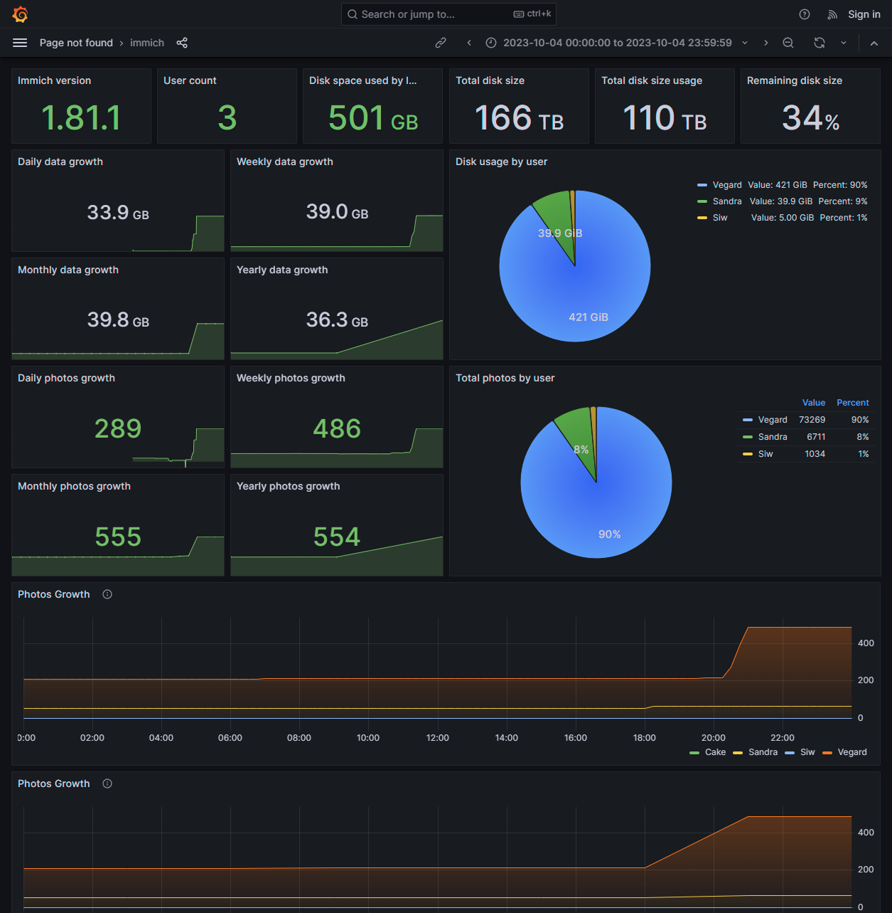

# Prometheus qBittorrent exporter

A prometheus exporter for qBitorrent. Get metrics from a server and offers them in a prometheus format.


## How to use it

You can install this exporter with the following command:

```bash
pip3 install prometheus-qbittorrent-exporter
```

Then you can run it with

```
qbittorrent-exporter
```

Another option is run it in a docker container.

```
docker run \
    -e QBITTORRENT_PORT=8080 \
    -e QBITTORRENT_HOST=myserver.local \
    -p 8000:8000 \
    ghcr.io/esanchezm/prometheus-qbittorrent-exporter
```
Add this to your prometheus.yml
```
  - job_name: "qbittorrent_exporter"
    static_configs:
        - targets: ['yourqbittorrentexporter:port']
```
The application reads configuration using environment variables:

| Environment variable       | Default       | Description |
| -------------------------- | ------------- | ----------- |
| `QBITTORRENT_HOST`         |               | qbittorrent server hostname |
| `QBITTORRENT_PORT`         |               | qbittorrent server port |
| `QBITTORRENT_USER`         | `""`          | qbittorrent username |
| `QBITTORRENT_PASS`         | `""`          | qbittorrent password |
| `EXPORTER_PORT`            | `8000`        | Exporter listening port |
| `EXPORTER_LOG_LEVEL`       | `INFO`        | Log level. One of: `DEBUG`, `INFO`, `WARNING`, `ERROR`, `CRITICAL` |
| `METRICS_PREFIX`           | `qbittorrent` | Prefix to add to all the metrics |
| `VERIFY_WEBUI_CERTIFICATE` | `True`        | Whether to verify SSL certificate when connecting to the qbittorrent server. Any other value but `True` will disable the verification |


## Metrics

These are the metrics this program exports, assuming the `METRICS_PREFIX` is `qbittorrent`:


| Metric name                                         | Type     | Description      |
| --------------------------------------------------- | -------- | ---------------- |
| `qbittorrent_up`                                    | gauge    | Whether if the qBittorrent server is answering requests from this exporter. A `version` label with the server version is added |
| `qbittorrent_connected`                                         | gauge    | Whether if the qBittorrent server is connected to the Bittorrent network.  |
| `qbittorrent_firewalled`                                        | gauge    | Whether if the qBittorrent server is connected to the Bittorrent network but is behind a firewall.  |
| `qbittorrent_dht_nodes`                                         | gauge    | Number of DHT nodes connected to |
| `qbittorrent_dl_info_data`                                      | counter  | Data downloaded since the server started, in bytes |
| `qbittorrent_up_info_data`                                      | counter  | Data uploaded since the server started, in bytes |
| `qbittorrent_torrents_count`                                    | gauge    | Number of torrents for each `category` and `status`. Example: `qbittorrent_torrents_count{category="movies",status="downloading"}`|

## Screenshot



[More info](./grafana/README.md)

## License

This software is released under the [GPLv3 license](LICENSE).
